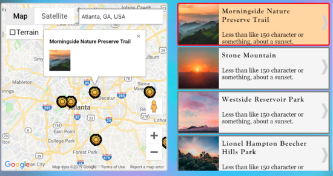

# Catch the Sun


## About 
Catch the Sun is a frontend web application for active explorers yearning to discover their next adventure, find hidden gem sceneries, and catch a beautiful sunset.

## Contributors
- Liz Khuu
- Clint Urbin
- Will Davis

## Technologies Used
- HTML, CSS, JavaScript, Google Maps API, Firebase

## Key Features
- Explorers can search map based on desired location
- Explorers can view markers and listing results based on their search query
- Explorers can view more information about each listing in a modal window

## Features in Detail
- EXPLORERS CAN SEARCH MAP BASED ON DESIRED LOCATION:
  - Using the Google Places Library, explorers are able to search the map based on their desired location.

    

    <div style="margin-top:10px; margin-bottom:10px; margin-left:35px"><em>Search map: Looking up San Diego, CA</em></div>

- EXPLORERS CAN VIEW MARKERS AND LISTING RESULTS BASED ON THEIR SEARCH QUERY
  - After inputting a location into the search box, explorers are able to view markers on the map (if any) that have been previously uploaded by other explorers for that area.

    

    <div style="margin-top:10px; margin-bottom:10px; margin-left:35px"><em>Get results: Map markers and listing results displayed after searching Atlanta, GA</em></div>

- EXPLORERS CAN VIEW MORE INFORMATION ABOUT EACH LISTING IN A MODAL WINDOW
  - As explorers view the search results for their query, they can click any of the individual listings to view additional information for each. 

    

    <div style="margin-top:10px; margin-bottom:10px; margin-left:35px"><em>Focus on an individual listing: Let's get more information about this listing!</em></div>

  - Clicking on a listing will open a modal window, which can be closed by clicking anywhere outside of it.

    

    <div style="margin-top:10px; margin-bottom:10px; margin-left:35px"><em>Modal window: Provides additional details for the explorer to view</em></div>

## Video Demo
  <div style='margin-left:70px; margin-top:10px'>
    <a href='https://youtu.be/3T0whD_oIG0' target='_blank'>
      
    </a>
  </div>

## Challenges

* MOVE LISTING FOR SELECTED MARKER TO TOP OF DISPLAY
    
  - How the feature works:  
      1) The user selects a marker on the map
      2) An Info Window for that marker is opened
      3) The listing for the selected marker is moved to the top of the display
  
  - Problem:

    When the user selects a marker on the map, the marker’s informational window opening would sometimes cause the viewport to shift. This viewport shift would then trigger the listings results to refresh, and then overwrite the initial call to display the user’s selected marker first. Thus, the user would continue to see an unordered display of listings.
  
  - Solution:

    To fix this problem, the displaySelectedMarkerFirst function call was wrapped in a setTimeout function. This gave the map a half second to refresh itself before updating the display listings.

    ```
    google.maps.event.addListener(marker, 'click', function() {
      infoWindow.setContent(addInfoWindowContent(pin));
      infoWindow.open(map, marker);
      window.setTimeout(function() {
          displaySelectedMarkerFirst(pin);
      }, 500);
    });
    ```